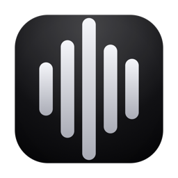
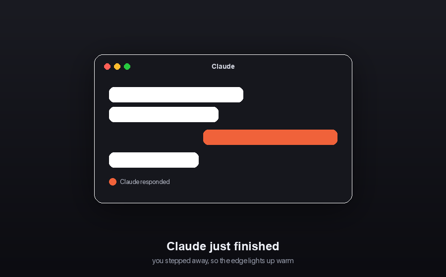
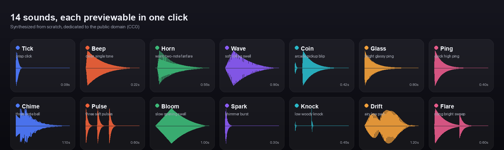
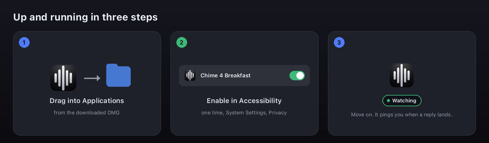

<div align="center">



## Chime 4 Breakfast

### Know when your AI is ready.

A native macOS menu-bar utility for **Codex Desktop** and **Claude Desktop**. Chime detects a finished response, distinguishes a normal completion from a likely blocker, and alerts you with the cue you chose: sound, app-colored screen glow, and optional banner.

<p>
  <a href="https://github.com/onekapisch/chime-4-breakfast/releases/latest/download/Chime-4-Breakfast.dmg"></a>
  <a href="https://github.com/onekapisch/chime-4-breakfast/releases/latest"></a>
  <a href="LICENSE"></a>
</p>

<sub>Universal for Apple Silicon and Intel - 100% local - No account - No telemetry</sub>

</div>

<div align="center">

<br/>
<sub>One compact popover for the alert settings that matter.</sub>
</div>

## What changed

- **Complete setup test.** Choose Codex or Claude from the checkmark in the header. Chime plays the selected completion sound, shows the matching glow, posts the optional banner, and logs the result in Recent.
- **Source-aware banners.** Click a Chime notification or its action to return to the Codex or Claude window that finished.
- **Reliable visual delivery.** Completion and attention use distinct source-app colors, and intensity controls the actual edge width, halo, and border brightness.
- **Clear support boundaries.** Supported setup, known limits, diagnostics, privacy notes, and the updater plan are documented in this repository.

<div align="center">

</div>

## The cue, not another inbox

| Watch | Classify | Alert |
| --- | --- | --- |
| Observes the visible Accessibility hierarchy in the supported desktop app. | A disappearing Stop control is confirmed before the latest assistant reply is classified. | A completion or attention cue is delivered once, using your sound, glow, and banner choices. |

- **Completion** is the quiet "your response is ready" cue.
- **Attention** is for likely questions, confirmations, and blockers.
- **Screen glow** appears only when you have moved away from the source app. It flashes for completion and pulses for attention on every connected display.
- **Recent activity** is session-only. No conversation history, analytics, or UI text leaves your Mac.

## See who is ready from across the room

<div align="center">

</div>

Chime uses the source app's icon color, so Codex and Claude remain distinct without asking you to decode a generic notification. The glow clears after the cue; it does not leave a persistent overlay.

## Make the alert yours

<div align="center">

</div>

Choose from 14 synthesized tones and two local macOS-spoken cues. Preview every choice in place, then assign by event or by provider. In **Per app** mode, Codex and Claude each keep their own sound identity. You can also keep only glow and run without sound.

The tones are generated from scratch by [`scripts/gen-sounds.py`](scripts/gen-sounds.py) and released under [CC0](Sources/Chime4BreakfastApp/Resources/Sounds/NOTICE.md). The spoken cues use your Mac's selected system voice.

## Install and verify

1. Download [**Chime-4-Breakfast.dmg**](https://github.com/onekapisch/chime-4-breakfast/releases/latest/download/Chime-4-Breakfast.dmg), drag Chime into Applications, and open it.
2. Grant the one-time Accessibility permission in **System Settings -> Privacy & Security -> Accessibility**.
3. Open the popover, choose **Test Codex** or **Test Claude** from the header checkmark, and confirm the cue before stepping away.

<div align="center">

</div>

It is Developer ID signed and Apple notarized. Chime requires **macOS 14 or later** and supports Apple Silicon and Intel Macs.

## Supported today

| Supported | Not supported yet |
| --- | --- |
| Codex Desktop and Claude Desktop conversation windows | Codex CLI, Claude Code, browser apps, and other desktop AI apps |
| Completion and attention alerts | A generic detector for arbitrary apps |
| Multi-display app-colored glow | Cloud sync or remote telemetry |

Read the full [support matrix](docs/SUPPORT.md) before relying on alerts in a new workflow.

## Privacy and detection

Chime detects a finish edge through the macOS Accessibility API: the supported app's generating or Stop control disappears, the change is confirmed on the next sample, and the latest visible assistant reply is classified with deterministic rules. No model call is involved.

The app works locally. It has no account, analytics, telemetry, or server. Session activity remains on the device and clears when the app exits. Diagnostics are explicit because a report can contain visible prompt or reply snippets; review it before sharing.

See [SECURITY.md](SECURITY.md) for data-handling details and [Troubleshooting](docs/TROUBLESHOOTING.md) for missed cues, permissions, and diagnostics.

## Build from source

> Requires **macOS 14+**, **Xcode 16+**, and [XcodeGen](https://github.com/yonaskolb/XcodeGen) (`brew install xcodegen`).

```bash
git clone https://github.com/onekapisch/chime-4-breakfast.git
cd chime-4-breakfast
xcodegen generate
open Chime4Breakfast.xcodeproj
```

Or build and launch from the terminal:

```bash
./scripts/run-debug.sh
```

For a stable local Accessibility identity across debug builds, run this once:

```bash
./scripts/setup-signing.sh
```

It writes a gitignored `Config/Local.xcconfig` with your stable signing identity. Grant Accessibility once more after it is configured.

Normal source builds intentionally run as **Chime 4 Breakfast Dev** with bundle identifier `app.chime4breakfast.debug`. The Dev app has its own Accessibility grant and login item, so building Debug or Release from Xcode cannot overwrite or invalidate the downloaded app. The public identity is reserved for the signed `Distribution` build produced by `scripts/build-release.sh`. In System Settings, enable the entry whose name matches the app you are running.

## Roadmap

- Validate and tune detection against more live Codex and Claude layouts
- Native auto-update through Sparkle, with signed appcast releases
- Custom import of user-licensed audio
- Add the next desktop provider only after adapter-specific live validation

The updater constraints are documented in [Auto-Update Readiness](docs/AUTO_UPDATE.md). Have an idea? [Open an issue](https://github.com/onekapisch/chime-4-breakfast/issues).

## Contributing

Contributions are welcome. See [CONTRIBUTING.md](CONTRIBUTING.md), [CODE_OF_CONDUCT.md](CODE_OF_CONDUCT.md), and the issue templates. For detection problems, attach diagnostics only after reviewing them for private content.

## FAQ

<details>
<summary><strong>Does it send prompts or replies anywhere?</strong></summary>

No. It has no server, account, analytics, or telemetry. The app uses the visible local Accessibility hierarchy to classify an event.
</details>

<details>
<summary><strong>Why does it need Accessibility?</strong></summary>

Accessibility is the macOS API that lets Chime observe the supported app's visible generating state and reply text. It is the core of the local detector.
</details>

<details>
<summary><strong>How do I know it works before I leave?</strong></summary>

Use the checkmark badge in the popover header and choose Test Codex or Test Claude. It exercises the selected sound and glow without waiting for a real response.
</details>

<details>
<summary><strong>Can Codex and Claude use different sounds?</strong></summary>

Yes. Choose Per app under Sounds, select a sound for each provider, and use the adjacent preview button.
</details>

<details>
<summary><strong>Why is it outside the Mac App Store?</strong></summary>

Reading another app's UI needs Accessibility, which is incompatible with App Sandbox distribution. Chime ships as a Developer ID-signed, Apple-notarized DMG.
</details>

---

<div align="center">

<strong>If Chime saves you a few "is it done yet?" checks, give the project a star.</strong>

Built for people who leave their AI running.

</div>
