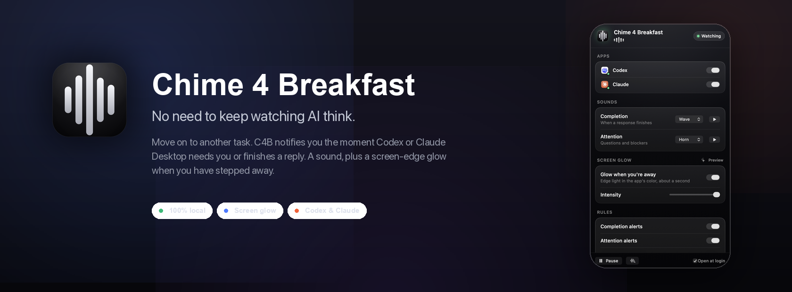
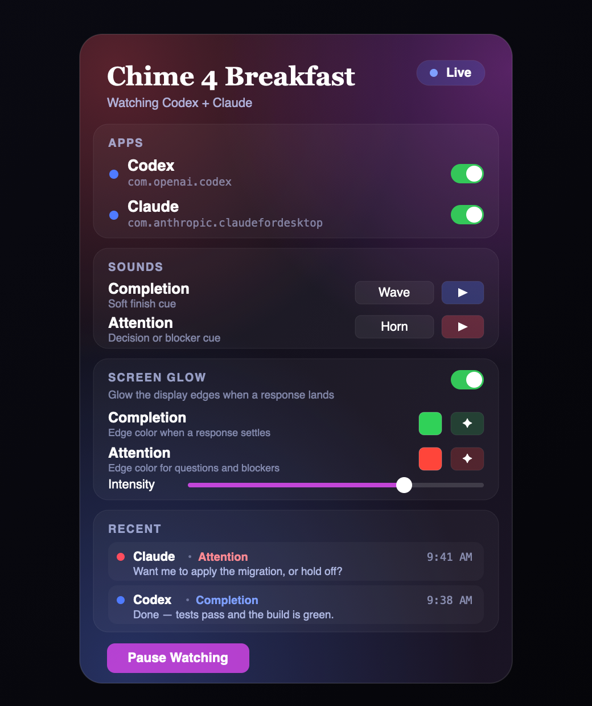
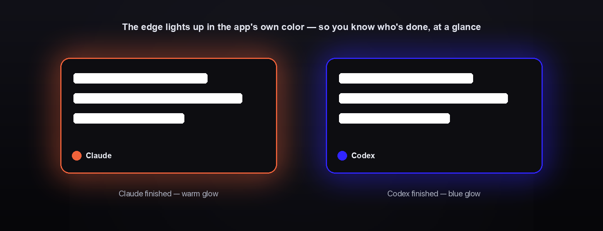

<div align="center">



### Walk away from your AI. It'll call you back.

Chime 4 Breakfast watches **Codex** and **Claude Desktop** and lets you know the moment a response lands — with a sound *and* a glow around your screen. One cue for "done," a bolder one for "it needs you."

<p>
  
  
  
  
  
  
</p>

<b><a href="#-get-started">Get started</a> · <a href="#-what-it-does">Features</a> · <a href="#-how-it-compares">Compare</a> · <a href="#-faq">FAQ</a> · <a href="CONTRIBUTING.md">Contributing</a></b>

</div>

---

You kick off a long task in Codex or Claude, switch to another window, and then… keep checking back. Did it finish? Is it stuck waiting on a yes/no? **Chime 4 Breakfast** ends the babysitting. It quietly watches the conversation and, the instant a reply settles, plays your chosen sound and lights up the edges of your display — so you can actually work on something else and trust you'll be pulled back at the right moment.

It's native, tiny, and lives in your menu bar. Everything happens on your Mac.

<div align="center">

<br/>
<sub>Everything lives in one compact popover — apps, sounds, screen glow, rules, and a recent-activity log.</sub>
</div>

## ✨ Why

- **🔔 Never miss a finished response** — step away without babysitting the chat window.
- **❗ "Done" vs "needs you" at a glance** — a calm cue for completions, a stronger one for questions and blockers.
- **🌗 Glanceable from across the room** — the screen-edge glow reads even when the window is behind something else.
- **🔒 Private by design** — captured text never leaves the machine. No account, no cloud, no telemetry.

## 🎯 What it does

- **Watches Codex & Claude Desktop** through the macOS Accessibility layer and fires **once per finished response**.
- **Two distinct signals** — a soft cue when a reply simply completes, a bolder cue when it looks like it's asking you something.
- **Full-screen edge glow** in colors you choose — completion fades quickly; attention pulses until you look.
- **14 built-in sounds** with live preview, assignable per signal.
- **Optional notification banners** for a classic Notification Center ping.
- **Quiet hours, custom attention phrases, launch at login**, and a compact local activity log.

<div align="center">

</div>

## 🌗 The signature: screen-edge glow

Sound is great until your speakers are muted or you're in another room. The glow is the part people keep. Pick a color for **completion** and one for **attention**, set the intensity, and your display edges light up the moment a reply lands — on every connected monitor. Completion gives a quick, calm pulse and fades; attention keeps glowing until you acknowledge it.

## 🔊 Sounds

A curated set of 14, each previewable in one click:

`Tick` · `Beep` · `Horn` · `Wave` · `Coin` · `Glass` · `Ping` · `Chime` · `Pulse` · `Bloom` · `Spark` · `Knock` · `Drift` · `Flare`

Assign one to completions and another to attention — or turn sound off entirely and keep just the glow.

## 🧠 How detection works

Chime 4 Breakfast reads the visible conversation text from the supported apps via the Accessibility API, waits for the latest reply to stop changing (so it fires once, not on every streamed token), then classifies it:

- contains a question, or phrases like *"let me know", "which one", "approve", "confirm"* → **Attention**
- anything else → **Completion**

The rules are deterministic and unit-tested — no model, no network call. If a response is ever misread, the popover's **Capture detection diagnostics** action writes exactly what the watcher saw to your Desktop so it can be fixed.

## 🆚 How it compares

| | **Chime 4 Breakfast** | macOS notifications | Terminal bell | Just… checking |
|---|:---:|:---:|:---:|:---:|
| Works with Codex & Claude **desktop apps** | ✅ | ❌ | ❌ | — |
| Knows **done** vs **needs your input** | ✅ | ❌ | ❌ | 🙂 |
| **Screen-edge glow** (works muted / across the room) | ✅ | ❌ | ❌ | ❌ |
| **Per-signal** sound + color | ✅ | ❌ | ❌ | — |
| Fires **once** per reply (debounced) | ✅ | — | — | — |
| **100% local**, no account | ✅ | ✅ | ✅ | ✅ |

## 🚀 Get started

> Requires **macOS 14+**, **Xcode 16+**, and [XcodeGen](https://github.com/yonyz/XcodeGen) (`brew install xcodegen`).

```bash
git clone https://github.com/onekapisch/chime-4-breakfast.git
cd chime-4-breakfast
xcodegen generate
open Chime4Breakfast.xcodeproj   # then Run the Chime4BreakfastApp scheme
```

Or build and launch straight from the terminal:

```bash
./scripts/run-debug.sh
```

On first launch, grant **Accessibility** access when prompted (System Settings → Privacy & Security → Accessibility), keep Codex or Claude open on a conversation, and wait for a reply to settle. You'll hear the sound and see the glow.

*(A signed, notarized DMG release is on the way — see [docs/RELEASE.md](docs/RELEASE.md).)*

## 🔒 Privacy & security

- Captured response text is used **only on-device** to classify and show a short recent-activity list.
- **Nothing is uploaded** — no analytics, no telemetry, no network calls.
- The only permission requested is **Accessibility**, required to read the visible reply text.
- Full details in [SECURITY.md](SECURITY.md).

## 🗺️ Roadmap

- Validate and tune detection against more live Codex/Claude layouts
- Per-app sound and glow overrides
- Custom sound import
- Support for Claude Code, Codex CLI, and the web apps
- Signed DMG releases + auto-update

Have an idea? [Open an issue](https://github.com/onekapisch/chime-4-breakfast/issues) — the roadmap is demand-driven.

## 🤝 Contributing

PRs and ideas are welcome. See [CONTRIBUTING.md](CONTRIBUTING.md) for setup, conventions, and how to attach detection diagnostics to a bug report.

## ❓ FAQ

**Is it really open source?** Yes — MIT licensed, source and all.

**Does it send my prompts or replies anywhere?** No. Everything runs locally; there are no servers and no telemetry.

**Why does it need Accessibility permission?** That's the macOS API that lets it read the visible reply text in another app. It's the whole mechanism.

**Does it work with Claude Code, Codex CLI, or the browser?** Not yet — it targets the Codex and Claude **desktop** apps today. The others are on the roadmap.

**Can I use my own sounds?** There are 14 built in for now; custom import is planned. You can also run sound-free and keep only the glow.

**Why isn't it on the Mac App Store?** Reading another app's UI requires Accessibility, which isn't allowed under the App Sandbox — so it ships as a notarized DMG / build-from-source instead.

---

<div align="center">

**⭐ If this saves you a few "is it done yet?" check-ins, give it a star — it genuinely helps other builders find it.**

Part of the **4 Breakfast** family · built for people who leave their AI running.

</div>
